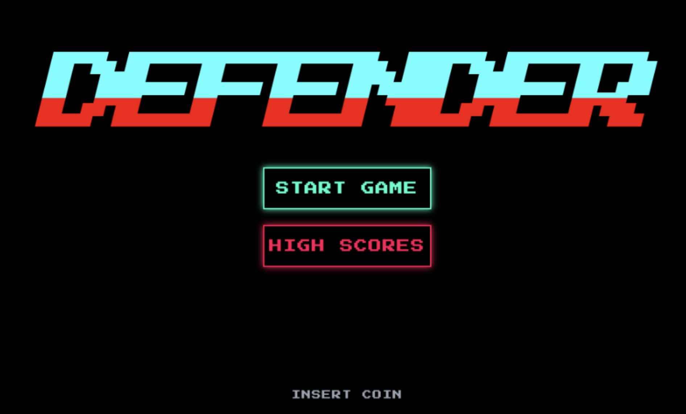
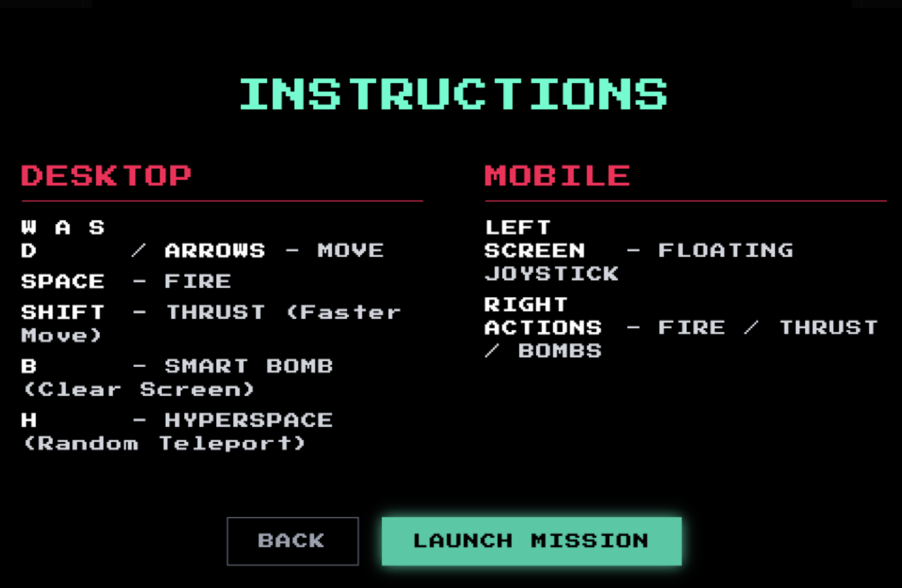
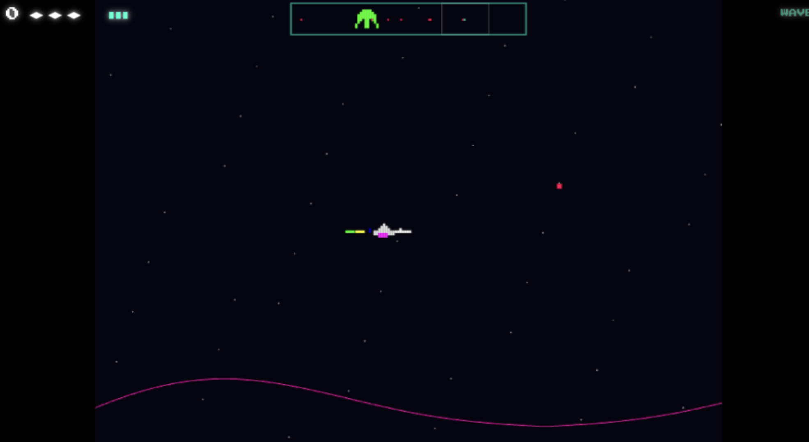

# Defender Arcade Clone

A web-based recreation of the classic 1981 arcade game "Defender", built strictly with React, TypeScript, and HTML5 Canvas. This project is a high-performance modern web clone featuring a retro-arcade neon aesthetic, multi-level wave progression, and seamless cross-platform support.

## Screenshots







## Features

- **Authentic Arcade Look**: Built with high-contrast neon styling, retro fonts, and pixel-art sprites drawing inspiration from late 70s / early 80s arcade cabinets.
- **High-Performance Canvas Rendering**: Uses a highly optimized game loop that manages enemies, projectiles, stars, and drawing logic on a responsive canvas element.
- **Cross-platform Contols**: The game supports precise desktop keyboard controls and a completely custom floating virtual joystick for seamless mobile web play.

## Controls

### Desktop
- **W, A, S, D / Arrow Keys**: Move
- **Space**: Fire
- **Shift**: Thrust (Faster Move)
- **B**: Smart Bomb (Clear Screen)
- **H**: Hyperspace (Random Teleport)

### Mobile
- **Left Side of Screen**: Floating Joystick (Drag to Move)
- **Right Side of Screen**: On-screen Action buttons (Fire, Thrust, Bombs)

## Installation & Running

To play this game locally on your machine, you must have [Node.js](https://nodejs.org/) installed. 

1. Navigate to the project directory:
   ```bash
   cd defender
   ```

2. Install the necessary dependencies (we rely on Vite as our React build tool):
   ```bash
   npm install
   ```

3. Start the local development server:
   ```bash
   npm run dev
   ```

4. Open the local link provided by your terminal (by default it will usually be `http://localhost:5173`) in your web browser.
